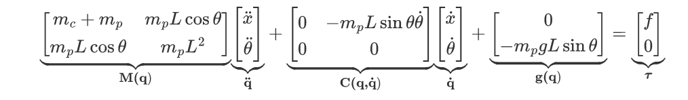

# Cart-Pole System Controlled by LQR, LMPC and NMPC Controllers

## Dependencies

- Matlab (Author's version is R2021a)
- Casadi : can be installed [here](https://web.casadi.org/)

## Cart-Pole System dynamics\underbrace m_c + m_p & m_pL\cos\theta\\

## Results

NMPC:

